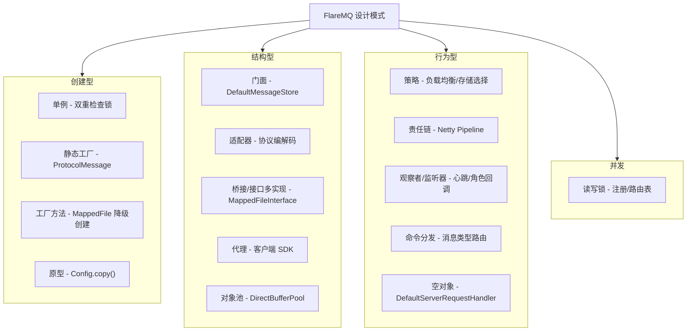

# FlareMQ 设计模式分析

FlareMQ 是一个自研的分布式消息队列，架构大量参考 RocketMQ。整个代码库在**创建型、结构型、行为型**三个维度上密集使用了经典设计模式，是面试讲解「设计模式如何在真实项目落地」的绝佳素材。



---

# 创建型模式

## 1. 单例模式 (Singleton) — 双重检查锁

`DirectBufferPool` 与 `MappedFileManager` 都使用经典的 double-checked locking 实现线程安全的单例。

**关键文件:**
- `flare-mq-protocol/src/main/java/com/flare/mq/protocol/zerocopy/DirectBufferPool.java:76-85`
- `flare-mq-protocol/src/main/java/com/flare/mq/protocol/zerocopy/MappedFileManager.java:57-66`

```java
public static MappedFileManager getInstance() {
    if (instance == null) {
        synchronized (MappedFileManager.class) {
            if (instance == null) {
                instance = new MappedFileManager();
            }
        }
    }
    return instance;
}
```

DirectBuffer 的分配和回收成本很高，全局复用同一个池可以显著减少 GC 压力。双重检查锁在第一次创建时加锁，之后走无锁快速路径，兼顾线程安全与性能。

---

## 2. 静态工厂方法 (Static Factory Method)

`ProtocolMessage` 提供静态工厂方法创建不同类型的响应消息：

```java
ProtocolMessage.createSuccessResponse(type, requestId, body)
ProtocolMessage.createErrorResponse(type, requestId, code)
ProtocolMessage.createHeartbeatResponse(requestId)
```

**关键文件:** `flare-mq-protocol/src/main/java/com/flare/mq/protocol/ProtocolMessage.java`

相比直接 `new ProtocolMessage(...)` 再逐字段 set，静态工厂方法语义更清晰，封装了通用的构造逻辑，调用方无需关心响应消息内部的组装细节。

---

## 3. 工厂方法模式 (Factory Method) — 按条件创建不同产品

`CommitLogManager` 在创建 CommitLog 文件时，根据 mmap 是否成功决定创建哪种文件实现，是典型的工厂方法：

```java
// CommitLogManager.java:270 createNewMappedFileInternal()
try {
    MappedFile mappedFile = new MappedFile(filePath, StoreConstants.COMMIT_LOG_FILE_SIZE);
    mappedFiles.put(newFileFromOffset, mappedFile);
    return mappedFile;
} catch (IOException e) {
    // mmap 失败，降级创建 SimpleMappedFile
    return createSimpleMappedFile(filePath, newFileFromOffset);  // :307
}
```

**关键文件:**
- `flare-mq-store/src/main/java/com/flare/mq/store/CommitLogManager.java:270, 307`
- `flare-mq-store/src/main/java/com/flare/mq/store/ConsumeQueueManager.java:91`（`getOrCreateConsumeQueue()` 创建或复用 `ConsumeQueue`）

**产品族（都实现 `MappedFileInterface`）：**

| 产品 | 底层 IO | 用途 |
|------|---------|------|
| `MappedFile` | `MappedByteBuffer` (mmap) | 正常路径，高性能 |
| `SimpleMappedFile` | `RandomAccessFile` | mmap 失败时的降级，保证服务不中断 |

工厂方法把「创建逻辑」集中起来，调用方只面向 `MappedFileInterface` 编程，完全不知道也不关心底层是哪种实现。

---

## 4. 原型模式 (Prototype) — 配置与消息的深拷贝

`ProducerConfig` / `ConsumerConfig` / `SubscriptionData` / `Message` 都提供了 `copy()` 方法，基于当前对象克隆出一个新的副本：

**关键文件:**
- `flare-mq-client/src/main/java/com/flare/mq/client/producer/ProducerConfig.java:215`
- `flare-mq-client/src/main/java/com/flare/mq/client/consumer/ConsumerConfig.java:245`
- `flare-mq-client/src/main/java/com/flare/mq/client/consumer/SubscriptionData.java:256`
- `flare-mq-client/src/main/java/com/flare/mq/client/producer/Message.java:269`

```java
public ProducerConfig copy() {
    ProducerConfig copy = new ProducerConfig();
    copy.producerGroup = this.producerGroup;
    // ... 逐字段拷贝
    return copy;
}
```

`ProducerImpl` 构造时执行 `this.config = config.copy()`，保留一份私有副本，避免外部调用方后续修改 Config 对象污染内部状态。`Message.copy()` 对 `body` 做了 `clone()` 深拷贝，防止字节数组被外部篡改。

---

# 结构型模式

## 5. 门面模式 (Facade) — 存储引擎的统一入口

`DefaultMessageStore` 是存储层的门面类，对外暴露简洁的 `putMessage()` / `getMessage()` API，内部协调了复杂的子系统：

```
DefaultMessageStore (门面)
  ├── CommitLogManager   — 消息顺序追加写入
  ├── ConsumeQueueManager — 索引构建与查询
  └── 定时刷盘 + 统计任务
```

**关键文件:** `flare-mq-store/src/main/java/com/flare/mq/store/DefaultMessageStore.java`

调用方（`BrokerRequestHandler`）完全不需要知道 CommitLog + ConsumeQueue 的内部协作细节（如序列化格式、文件分片、偏移量计算等）。

---

## 6. 适配器模式 (Adapter) — 协议编解码

`ProtocolEncoder` / `ProtocolDecoder` 继承 Netty 的 `ByteToMessageDecoder` / `MessageToByteEncoder`，将两种不兼容的模型对接：

```
业务层: ProtocolMessage (totalLength + type + requestId + status + body)
          ↕ 适配
传输层: ByteBuf (原始字节流)
```

**关键文件:**
- `flare-mq-protocol/src/main/java/com/flare/mq/protocol/codec/ProtocolEncoder.java`
- `flare-mq-protocol/src/main/java/com/flare/mq/protocol/codec/ProtocolDecoder.java`

---

## 7. 桥接 / 接口多实现 — MappedFileInterface 的两种实现

`MappedFileInterface` 定义统一的文件读写接口，有两个底层 IO 方式截然不同的实现，但对外暴露完全一致的 API：

| 实现 | 底层 IO 方式 | 性能 |
|------|-------------|------|
| `MappedFile` | `MappedByteBuffer` (mmap) | 高（零拷贝） |
| `SimpleMappedFile` | `RandomAccessFile.seek()+read()/write()` | 低（传统 IO） |

**关键文件:**
- `flare-mq-store/src/main/java/com/flare/mq/store/MappedFileInterface.java:10`
- `flare-mq-store/src/main/java/com/flare/mq/store/MappedFile.java:23`
- `flare-mq-store/src/main/java/com/flare/mq/store/SimpleMappedFile.java:20`

上层 `CommitLogManager` 通过 `ConcurrentSkipListMap<Long, MappedFileInterface>` 管理文件集合，完全不感知底层实现。当 mmap 创建失败时自动降级为 `SimpleMappedFile`，对上层透明——服务不中断。

> 面试提示：从严谨的 GoF 定义看，这是「接口 + 多实现」的经典用法（也可以归入策略模式的思想）；桥接模式通常强调「抽象与实现两个维度独立变化」。本项目中它解决的核心问题是**实现可替换、降级透明**，讲清楚这一点比纠结叫桥接还是策略更有说服力。

**三级降级策略（MappedFile.java:194-251）：**
1. 尝试 mmap 大文件（3 次重试，递增等待）
2. 失败后 mmap 更小的文件（64KB）
3. 仍失败则降级为 RandomAccessFile 传统 IO

---

## 8. 代理模式 (Proxy) — 客户端 SDK

`ProducerImpl` / `ConsumerImpl` 实现 `Producer` / `Consumer` 接口，对使用者隐藏了背后的复杂网络通信细节：

```
用户代码 → ProducerImpl.send(msg)
              → 查 NameServer 获取路由（带本地缓存）
              → 连接目标 Broker
              → 序列化 + Netty 发送
              → 反序列化响应
           ← 返回 SendResult
```

**关键文件:**
- `flare-mq-client/src/main/java/com/flare/mq/client/producer/ProducerImpl.java:28`
- `flare-mq-client/src/main/java/com/flare/mq/client/consumer/ConsumerImpl.java:32`

用户感知的只是一个 `send(Message)` 方法调用，实际经历了路由发现、连接管理、协议编解码、故障转移等多个复杂步骤。本地 `TopicRouteInfo` 缓存 + 自动过期刷新进一步隐藏了网络延迟。

> 面试提示：这里更准确地说是「接口隔离 + 门面」思想——`Producer` 接口把实现细节（网络、协议、路由）全部封装在 `Impl` 里。面试时把它讲成代理模式的实践（替身代表真实的网络服务）也常见，但补一句「核心是隐藏复杂度」即可应对追问。

---

## 9. 对象池模式 (Object Pool) — DirectBuffer 复用

`DirectBufferPool` 维护了一组不同大小的 `ConcurrentLinkedQueue<ByteBuffer>` 池：

- `acquire(size)` — 从池中复用已有 buffer，命中返回池中对象，未命中才分配新 DirectBuffer
- `release(buffer)` — 归还 buffer 到池中，避免 GC 频繁回收 DirectByteBuffer

**关键文件:** `flare-mq-protocol/src/main/java/com/flare/mq/protocol/zerocopy/DirectBufferPool.java`

DirectBuffer 的分配和回收不受 JVM 堆 GC 管理，成本高。对象池模式在这里是经典的性能优化手段。

---

# 行为型模式

## 10. 策略模式 (Strategy) — 算法族可动态切换

策略模式在项目中多处使用，将不同算法封装为可替换的策略：

| 位置 | 策略上下文 | 具体策略 |
|------|-----------|---------|
| `GlobalLoadBalancer` (nameserver) | `switch (strategy)` 分发 | 轮询、随机、一致性哈希、最少活跃、加权轮询 |
| `BrokerSelector` (nameserver) | `switch (strategy)` 分发 | 同上 5 种 + 按消息特征选择（性能/磁盘） |
| `LoadBalancer` (broker) | `LoadBalanceStrategy` 枚举 | 多种 Broker 负载均衡算法 |
| `AdaptiveStorageStrategy` (store) | 接口 → `DefaultAdaptiveStorageStrategy` | 根据消息热度选择冷/热/温存储 + 压缩策略 |

**关键文件:**
- `flare-mq-nameserver/src/main/java/com/flare/mq/nameserver/routing/global/GlobalLoadBalancer.java`
- `flare-mq-nameserver/src/main/java/com/flare/mq/nameserver/routing/cluster/BrokerSelector.java`
- `flare-mq-broker/src/main/java/com/flare/mq/broker/cluster/LoadBalancer.java`
- `flare-mq-store/src/main/java/com/flare/mq/store/AdaptiveStorageStrategy.java`
- `flare-mq-store/src/main/java/com/flare/mq/store/DefaultAdaptiveStorageStrategy.java`

策略模式让负载均衡算法和存储策略在运行时动态切换，完全符合开闭原则——新增策略无需修改调用方代码。

**分层编排的例证：** `SmartRoutingEngine` 将路由决策分为三个独立层，每层内部又各自组合了策略：

```
SmartRoutingEngine.route(message)
  → 第1层 GlobalRouter   — 一致性哈希选集群（跨地域全局路由）
  → 第2层 ClusterRouter  — 负载均衡选 Broker（集群内路由，带故障转移）
  → 第3层 LocalRouter    — 选具体队列（Broker 内本地路由）
```

**关键文件:**
- `flare-mq-nameserver/src/main/java/com/flare/mq/nameserver/routing/SmartRoutingEngine.java`
- `flare-mq-nameserver/src/main/java/com/flare/mq/nameserver/routing/global/GlobalRouter.java`
- `flare-mq-nameserver/src/main/java/com/flare/mq/nameserver/routing/cluster/ClusterRouter.java`
- `flare-mq-nameserver/src/main/java/com/flare/mq/nameserver/routing/local/LocalRouter.java`

每一层独立封装，层与层之间通过明确的输入/输出对象衔接（`GlobalRoute` → `ClusterRoute` → `RouteResult`），新增或替换某一层算法均不影响其他层。

---

## 11. 责任链模式 (Chain of Responsibility) — Netty Pipeline

通过 Netty 的 `ChannelPipeline` 构建消息处理链，每个 Handler 职责单一：

```
ByteBuf 流入
  → ProtocolDecoder  （字节 → ProtocolMessage，零拷贝优化）
  → ProtocolEncoder  （ProtocolMessage → 字节，出站时生效）
  → ServerHandler    （业务分发 → ServerRequestHandler 接口）
  → BrokerRequestHandler / NameServerRequestHandler（具体业务处理）
```

**关键文件:**
- `flare-mq-protocol/src/main/java/com/flare/mq/protocol/server/NettyServer.java:64-79`
- `flare-mq-protocol/src/main/java/com/flare/mq/protocol/server/ServerHandler.java`
- `flare-mq-protocol/src/main/java/com/flare/mq/protocol/server/ServerRequestHandler.java`

每个 Handler 只需关注自己这一环，可插拔、可替换。

---

## 12. 观察者 + 监听器回调 (Observer / Listener) — 事件驱动的解耦

观察者/回调模式在项目里贯穿「健康检查、集群角色、消息重试」三类场景：

- **`HealthChecker`** — 定时轮询 Broker 心跳表，当 Broker 超时未心跳时主动将其剔除。Broker 定期「通知」（心跳），HealthChecker 在观察到异常时触发清理动作，是发布-订阅模式的变体。
- **`MessageHeatAnalyzer`** — 记录并分析每条消息的访问频率，`IntelligentStorageManager` 根据热度变化调整消息的存储层级。
- **`ClusterRoleListener`** — Broker 侧定义的角色变化回调接口（`onBecomeMaster(epoch)` / `onStandDown()`），由 `ClusterManager` 实现并注入 `BrokerRequestHandler`，用于控制写入口（`BrokerRequestHandler.java:51`）。
- **`setHeartbeatLossListener`** — `BrokerRegistration` 心跳丢失时回调 `ClusterManager.onHeartbeatLost()`，触发故障转移（`BrokerRegistration.java:64`）。
- **`AckManager.setRetryHandler`** — 重试消息投递的回调，由 `ClusterManager` 注入具体实现（`AckManager.java:54`）。

**关键文件:**
- `flare-mq-nameserver/src/main/java/com/flare/mq/nameserver/health/HealthChecker.java`
- `flare-mq-store/src/main/java/com/flare/mq/store/MessageHeatAnalyzer.java`
- `flare-mq-store/src/main/java/com/flare/mq/store/IntelligentStorageManager.java`
- `flare-mq-broker/src/main/java/com/flare/mq/broker/BrokerRequestHandler.java:51`（`ClusterRoleListener`）
- `flare-mq-broker/src/main/java/com/flare/mq/broker/registry/BrokerRegistration.java:64`
- `flare-mq-broker/src/main/java/com/flare/mq/broker/ack/AckManager.java:54`

观察者/回调让事件源（心跳、角色切换、重试）与响应逻辑（剔除、停写、重新投递）解耦，新增响应方无需改动事件源。

---

## 13. 命令模式 (Command) — 协议消息分发

`BrokerRequestHandler.handleRequest()` / `NameServerRequestHandler.handleRequest()` 通过 `switch (request.getType())` 将不同的消息类型分发到不同的处理方法：

```
SEND_MESSAGE_REQUEST    → handleSendMessage()
PULL_MESSAGE_REQUEST    → handlePullMessage()
ACK_MESSAGE_REQUEST     → handleAckMessage()
CREATE_TOPIC_REQUEST    → handleCreateTopic()
DELETE_TOPIC_REQUEST    → handleDeleteTopic()
LIST_TOPICS_REQUEST     → handleListTopics()
UPDATE_CONSUMER_OFFSET  → handleUpdateConsumerOffset()
QUERY_CONSUMER_OFFSET   → handleQueryConsumerOffset()
BECOME_MASTER / STAND_DOWN → handleBecomeMaster() / handleStandDown()
```

**关键文件:**
- `flare-mq-broker/src/main/java/com/flare/mq/broker/BrokerRequestHandler.java:76-99`
- `flare-mq-nameserver/src/main/java/com/flare/mq/nameserver/NameServerRequestHandler.java:64-91`

每条消息携带完整的请求数据（消息类型 + 请求体），类似于 Command 对象封装了操作和参数。`ServerRequestHandler` 统一了 Broker / NameServer 两端的处理入口，是 SPI 式的插件点。

> 面试提示：这里是命令模式的简化形态——请求本身就是命令（类型 + 参数），处理器按类型表驱动分发。若面试官追问「为什么不直接建 Command 对象」，可答：消息队列协议天然用「类型 + 参数」表达请求，switch 表驱动已经足够清晰且便于新增类型。

---

## 14. 空对象模式 (Null Object) — 默认请求处理器

`DefaultServerRequestHandler` 提供 `ServerRequestHandler` 的默认空实现：心跳响应、空消息占位、统一错误响应等，行为无害。

**关键文件:**
- `flare-mq-protocol/src/main/java/com/flare/mq/protocol/server/DefaultServerRequestHandler.java:16`
- `flare-mq-protocol/src/main/java/com/flare/mq/protocol/server/NettyServer.java:34-36`

```java
public NettyServer(int port) {
    this(port, new DefaultServerRequestHandler());  // 默认空对象，避免 null 判断
}
```

Broker / NameServer 通过有参构造注入真实的 `BrokerRequestHandler` / `NameServerRequestHandler`。空对象让 `NettyServer` 在无业务实现时也能安全启动，避免处处判空。

---

# 并发模式

## 15. 读写锁模式 (ReadWriteLock)

在注册中心和路由管理器中广泛使用 `ReentrantReadWriteLock` 进行并发控制：

- **读操作**（查询路由、获取 Broker 列表）— 拿读锁，允许高并发
- **写操作**（注册/注销 Broker、更新路由表）— 拿写锁，互斥执行

**关键文件:**
- `flare-mq-nameserver/src/main/java/com/flare/mq/nameserver/registry/ServiceRegistry.java`
- `flare-mq-nameserver/src/main/java/com/flare/mq/nameserver/route/RouteInfoManager.java`

这是读多写少场景下的经典并发优化，用读写分离替代互斥锁，大幅提升查询吞吐。

---

# 总结

| 设计模式 | 应用场景 | 核心价值 |
|---------|---------|---------|
| **单例** | DirectBuffer / 文件映射池 | 全局复用，减少分配开销 |
| **静态工厂** | 协议消息创建 | 语义清晰，封装构造逻辑 |
| **工厂方法** | MappedFile 创建与降级 | 创建逻辑集中，降级透明 |
| **原型** | 配置与消息深拷贝 | 隔离外部修改，保护内部状态 |
| **门面** | 存储引擎入口 | 简化调用方，隐藏子系统复杂度 |
| **适配器** | 协议编解码 | 对接 Netty 框架与自定义协议 |
| **桥接/接口多实现** | mmap/传统IO双实现 | 实现可替换，降级不中断服务 |
| **代理** | 客户端 SDK | 隐藏网络通信复杂度 |
| **对象池** | DirectBuffer 复用 | 减少 GC 压力，提升性能 |
| **策略** | 负载均衡、存储选择 | 算法可运行时切换，符合开闭原则 |
| **责任链** | Netty 消息处理管道 | 各环节独立，可插拔 |
| **观察者/监听器** | 健康检查、角色回调、重试 | 解耦事件源与响应逻辑 |
| **命令** | 消息类型分发处理 | 请求封装，集中路由 |
| **空对象** | 默认请求处理器 | 避免 null 判断，提供无害默认 |
| **读写锁** | 注册/路由表并发控制 | 读多写少场景的并发优化 |
