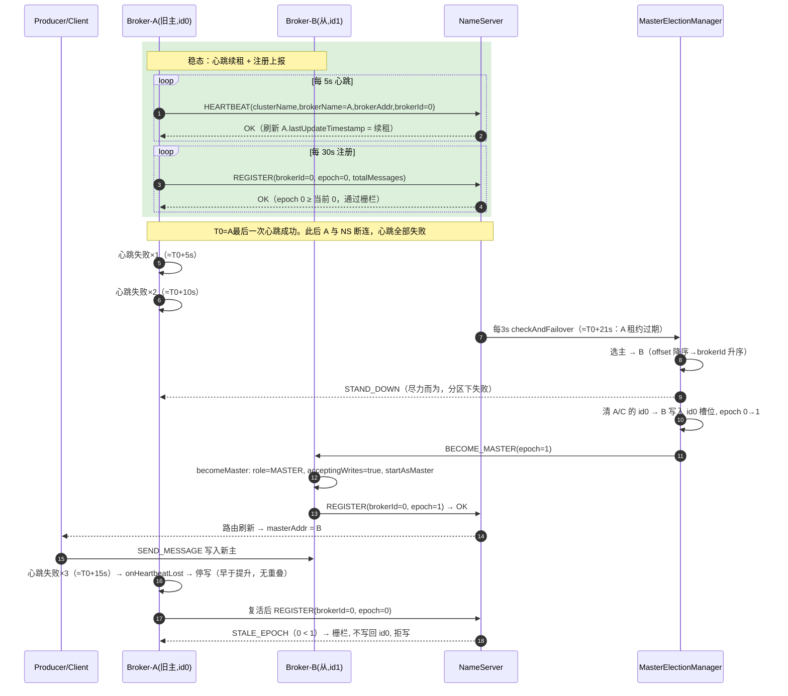

# Broker 集群：命名、租约选举与故障转移设计

- 日期：2026-08-22
- 状态：已与用户对齐，待评审
- 范围：flare-mq-broker / flare-mq-nameserver / flare-mq-client（仅测试涉及）

## 1. 背景与问题

当前 Broker 集群存在三类不完善，均已读码核实：

1. **命名全是默认值**：`BrokerStartup.BrokerConfig` 默认 `brokerName="broker-a"`、`brokerId=0`、addr=`127.0.0.1:10911`。多节点不传参即撞 `ServiceRegistry` 的 `brokerAddrTable` key（`key=brokerName`），互相覆盖。
2. **选举空转**：`ClusterManager.clusterNodes` 是纯本地 map（`joinCluster()` 只把自己放进去，`ClusterManager.java:291`），`tryBecomeMaster()`/`triggerMasterElection()` 只看得见当前 JVM，跨进程选举是死代码。
3. **故障转移空转**：`FailoverManager.detectFailures()` 遍历的也是本地 map（`FailoverManager.java:156`），多进程下检测不到真实节点故障，`selectNewMaster/promoteToMaster` 全部操作本地对象。

另有四个已核实的连带问题：

- **`-n` 参数丢失**：`ClusterManager.start()` 硬编码 `nameServerAddr="localhost:9876"`（`ClusterManager.java:155`），`BrokerStartup` 解析的 `-n` 从未传进来。
- **心跳链路断裂**：`NameServerRequestHandler.handleRequest()` 对 `HEARTBEAT_REQUEST` 只回空响应（`NameServerRequestHandler.java:51`），从未调用 `HealthChecker.processBrokerHeartbeat()`。broker 每 10s 的心跳只保住 TCP 连接，不刷新任何存活记录；当前真实的存活信号是每 30s 的 `registerBroker`。
- **offset 未持久化**：`BrokerData.totalMessages` 字段存在（`BrokerData.java:20`）但 `ServiceRegistry.registerBroker()` 从未赋值；`RegisterBrokerRequest` 已携带 `totalMessages`，无人落库。
- **重复的 FailoverManager**：nameserver 侧存在 `routing/cluster/FailoverManager.java` + `ClusterRouter.java`，与 broker 侧职责打架，需要收敛。

## 2. 目标与非目标

### 目标

- 多 broker 无需显式配置即可组成一主多从集群（brokerName / brokerId 自动唯一）。
- master 故障后自动选出新 master，写路径持续可用。
- 全程保证**单主**（无脑裂 / 无双主）。
- 修复心跳、offset 持久化、`-n` 参数等已知缺陷。

### 非目标（明确不做）

- **真实数据复制**：当前 `ReplicationManager.replicateToSlave()` 是模拟实现（`Thread.sleep(latency)` + `Math.random()>0.05`，`ReplicationManager.java:287`）。本设计不引入真实日志复制，因此 **failover 只保证"写路径可用 + 单主"，不承诺消息数据零丢失**——那需要单独的复制设计。
- **多 NameServer 共识（Raft）**：本设计采用"单决策权威"（见 §3），NameServer 集群只作为路由查询备份，不在本次范围。

## 3. 核心设计原则

1. **NameServer 是唯一决策权威**：选举、租约判定、epoch、提升、stand down 全部由 NameServer 单点拍板；broker 是被指挥的执行者。
2. **租约（lease）+ epoch 栅栏防双主**：租约保证"旧 master 停写"严格早于"新 master 开写"（时间窗零重叠）；epoch 兜底拦截携带旧版本的幽灵写。
3. **选举确定性**：给定相同的存活集合与 offset 快照，选举结果唯一，无需协调即可复算。
4. **客户端零改动**：沿用 brokerId 0 = master 的既有约定（`TopicRouteInfo.getMasterAddr()` 读 `brokerAddrs.get(0L)`，`TopicRouteInfo.java:203`），切换只发生在 NameServer 的注册/路由数据上。

## 4. 架构总览

```
                  ┌─────────────────────────────────────┐
                  │        NameServer（单一决策权威）       │
                  │  ServiceRegistry（注册表 + offset）     │
                  │  HealthChecker（存活 / 租约扫描）         │
                  │  MasterElectionManager（新增）          │
                  └────────┬──────────────────┬──────────┘
           注册/心跳/续租   │                  │ BECOME_MASTER / stand down
                  ┌────────┴───────┐   ┌──────┴────────┐
                  │ Broker-A (master)│   │ Broker-B (slave)│ ...
                  └────────────────┘   └───────────────┘
       每个 broker 只持有自己的本地角色；集群真相在 NameServer。
```

## 5. 详细设计

### §1 Broker 命名与身份

**现状**：默认 `brokerName="broker-a"`、`brokerId=0`、addr `127.0.0.1:10911`。

**方案**（均可被命令行 `-b / -i / -a` 覆盖）：

- `brokerName` 默认由 `host:port` 推导，如 `127.0.0.1-10911` —— 天然唯一。
- `brokerId` 默认由端口推导：`port - 10911`（10911→0、10912→1、10913→2）—— 天然唯一，且保留 brokerId 0 = master 约定。
- 修复 `ClusterManager.start()` 的 `nameServerAddr` 硬编码：`BrokerStartup` 把解析出的 `-n` 经 `ClusterConfig` 传入 `ClusterManager`。

> 效果：一条命令用不同端口开 3 个 broker，即自动形成 1 主 2 从，无需任何配置。

### §2 存活检测 + 租约（lease）

**现状**：心跳不刷新存活；真实存活信号是 30s 注册；`HealthChecker` 用"心跳超时"判定。

**方案**：

- **修复心跳链路**：broker 心跳请求携带 `clusterName / brokerName / brokerId`；`NameServerRequestHandler` 的 `HEARTBEAT_REQUEST` 分支调用 `HealthChecker.processBrokerHeartbeat()` 真正刷新存活——刷新按 `brokerName` 索引的 `BrokerData.lastUpdateTimestamp`（即续租）。
- **master 租约**：`leaseDuration = 20s`，续租并进心跳（5s 一次）。`MasterElectionManager` 判定失效的公式为"**最后续租时刻 + 完整租约期已过**"（`now - lastUpdateTimestamp > leaseDuration`）。
- **master 主动让位**：连续 3 次续租失败（≈15s < 租约 20s）→ 立即停止接受新写、降级为待命、广播让位。这是租约成立的前提，由 broker 自己遵守。

### §3 选举 + epoch（防双主核心）

**选主规则（确定性）**：在"存活且可用、且非当前故障 master"的候选节点中：

1. 主排序：`totalMessages`（消息 offset 代理指标）**降序**，取最大者。
2. 平局决胜：offset 相同则 `brokerId` **升序**取最小者。

```text
候选排序：offset 降序 → brokerId 升序 → 第一名当选
```

> 依据：offset 越大说明该 slave 数据越接近旧 master，切换后丢失最少——主从切换标准启发式。`totalMessages` 已在 `RegisterBrokerRequest` 上报，只需落库（见 §6）。

**epoch + 栅栏**：

- 每次选举产生单调递增的 `epoch`（AtomicLong，从 0 起，每次 +1），由 `MasterElectionManager` 持有。
- master 的写请求/注册携带当前 `epoch`；NameServer 拒绝携带旧 `epoch` 的写与注册。幽灵 master 即使存活，其旧 token 在落点被挡。

**时序保证**（租约 + 提升次序咬合，时间窗零重叠；T0 = 旧主最后一次成功心跳）：

> 前提约束：`3 × 心跳间隔 < 租约`（5s×3=15s < 20s）。否则分区场景下旧主自行停写会晚于新主开写，出现双写窗口。

```mermaid
gantt
    title 心跳租约选举时序（参数：心跳 5s · 租约 20s · failover 扫描 3s）
    dateFormat X
    axisFormat %s
    section Broker-A(旧主)
    心跳正常(续租)            :a1, 0, 5
    断连·仍接受写入            :a2, 5, 15
    自行停写(第3次失败)        :a3, 15, 40
    复活·被STALE_EPOCH栅栏     :a4, 45, 55
    section NameServer
    租约窗口(lastUpdate+20s)   :n1, 0, 20
    failover扫描@T0+21s        :n2, 21, 21
    提升B为Master(epoch=1)     :n3, 21, 24
    section Broker-B(新主)
    BECOME_MASTER(epoch=1)     :b1, 21, 24
    B开始接受写入              :b2, 24, 60
    section 单主重叠分析
    停写→开写安全间隙          :ov, 15, 21
```



### §4 故障转移链路（检测 → 选举 → 提升 → 降级）

全部在 NameServer 的单一决策权威上串起来。新增 **`MasterElectionManager`**（nameserver 侧组件），由 `NameServerController` 的周期任务（每 3s）触发 `checkAndFailover()`。

**决策状态机**：

```mermaid
flowchart TD
    Start[NameServer 每3s: checkAndFailover] --> A{findAliveMaster?<br/>存在 id0 持有者且租约未过期}
    A -- 是 --> Idle[当前主存活, 跳过]
    A -- 否 --> B[findStaleMaster: id0 持有者但租约已过]
    B --> C[aliveSlaves(staleMaster): 存活且排除故障/被栅栏的旧主]
    C --> D{electNewMaster<br/>先过滤 hasUsableAddr<br/>再按 totalMessages降序→brokerId升序}
    D -- 无候选 --> E[告警, 下轮重试]
    D -- winner --> F[sendStandDown(旧主) 尽力而为]
    F --> G[clearStaleId0Slots: 移除除赢家外所有节点 id0]
    G --> H[promoteToMaster: 赢家写入 id0 槽位, epoch+1]
    H -- addr 无效(-1) --> E
    H -- ok --> I[旧主≠赢家: migrateTopicRoutes 旧主→赢家]
    I --> J{sendBecomeMaster(赢家, epoch) 成功?}
    J -- 否 --> L[rollbackPromotion: 移除赢家 id0, 下轮重扫]
    J -- 是 --> K[新主 becomeMaster: 翻转角色/开写/以新 epoch 重注册]
    L --> C
    K --> M[旧主复活: STALE_EPOCH 栅栏拒写, 槽位不写回]
```

**运行时交互时序**：



### §5 路由与客户端切换

**方案**：新 master 的地址落到 `BrokerData.brokerAddrs` 的 brokerId 0 槽位。客户端 `TopicRouteInfo.getMasterAddr()`（读 brokerId 0 槽位）无需改动，下次拉取路由即写到新 master。

**Topic 写队列迁移**：提升时 NameServer 将涉及 topic 的写队列路由（`registerTopicRoute` / `updateTopicRouteInfo`）指向新 master 地址，使 topic 的 `queueDatas` 不再引用已死节点。

> 边界：消费端偏移量（`ConsumerOffsetManager`）不跨节点迁移；failover 保证的是"写路径持续可用 + 单主"，不保证数据零丢失（见 §2 非目标）。

### §6 死代码清理与数据落库

- **nameserver 侧**：删除重复的 `routing/cluster/FailoverManager.java` 与 `ClusterRouter.java`，职责收敛到新的 `MasterElectionManager`。
- **broker 侧**：删除 `FailoverManager` / `LoadBalancer` 中基于本地 `clusterNodes` 的空转逻辑；`ClusterManager.clusterNodes` 不再承担决策，只反映本地角色。broker 保留的执行器职责：响应 `BECOME_MASTER` / `stand down`、续租失败停写。
- **数据落库**：`ServiceRegistry.registerBroker()` 把 `RegisterBrokerRequest.totalMessages` 写入 `BrokerData.setTotalMessages()`（字段现成，补齐赋值）。

## 6. 数据模型 / 协议变更

| 变更 | 位置 | 说明 |
|---|---|---|
| 心跳携带身份 | `ProtocolMessage` 心跳请求体 / broker `BrokerRegistration.sendHeartbeat()` | 新增 `clusterName/brokerName/brokerId` 字段 |
| 心跳刷新存活 | `NameServerRequestHandler` HEARTBEAT 分支 | 调用 `processBrokerHeartbeat()` |
| offset 落库 | `ServiceRegistry.registerBroker()` | 写入 `BrokerData.totalMessages` |
| 新 RPC：BECOME_MASTER | `MessageType` 枚举 + broker 处理器 | NameServer → 新 master |
| 新 RPC：stand down | `MessageType` 枚举 + broker 处理器 | NameServer → 旧 master（防御性） |
| epoch 存储 | `MasterElectionManager` | 进程内 `AtomicLong` |

## 7. 涉及模块与文件

**flare-mq-nameserver**
- 新增 `MasterElectionManager.java`
- 改 `NameServerRequestHandler.java`（心跳分支、新 RPC 分支）
- 改 `ServiceRegistry.java`（offset 落库、master 槽位更新辅助）
- 改 `HealthChecker.java`（租约公式、key 用 brokerName）
- 删 `routing/cluster/FailoverManager.java`、`routing/cluster/ClusterRouter.java`

**flare-mq-broker**
- 改 `BrokerStartup.java`（命名/ID 推导、`-n` 传递）
- 改 `ClusterConfig.java`（新增 nameServerAddr、lease 参数）
- 改 `ClusterManager.java`（nameServerAddr 注入；本地角色由 NameServer 指挥）
- 改 `BrokerRegistration.java`（心跳携带身份）
- 改 `BrokerRequestHandler.java`（新增 BECOME_MASTER / stand down 分支）
- 删 `cluster/FailoverManager.java`；瘦身 `cluster/LoadBalancer.java` 的本地空转逻辑

**flare-mq-protocol**
- `MessageType.java` 新增 `BECOME_MASTER_REQUEST/RESPONSE`、`STAND_DOWN_REQUEST/RESPONSE`

**flare-mq-test / flare-mq-broker 测试**
- 新增/更新单测与集成测试（见 §8）

## 8. 测试与验证

**单测**

- 选举规则：offset 大者当选；offset 平局时 brokerId 小者当选；死亡节点即使 offset 最大也不当选。
- 租约公式：`lastLease + leaseDuration` 未过 → 存活；已过 → 失效。
- epoch：每次选举单调递增；旧 epoch 写被拒。
- 命名/ID 推导：`host:port` → brokerName；`port-10911` → brokerId；显式传参覆盖。

**集成测试**（仿照 `flare-mq-test/.../rebalance/RebalanceTest.java` 模式）

- 起 1 NameServer + 3 Broker（端口 10911/10912/10913）。
- 向 master 写消息，制造 slave-B 与 slave-C 的 offset 差异。
- **kill master** → 断言：新 master 被选出（offset 大者）、路由切到新 master、客户端继续写入成功、epoch 递增。
- 已有 `ClusterTest` / `BrokerSendMessageTest` 保证不回归。

## 9. 风险与边界

- **单决策权威**：NameServer 进程挂则无选举决策（路由查询可用性不在本次范围）。
- **无数据复制**：failover 不保证零丢失；若演示需展示数据延续，须另做真实复制。
- **租约参数**：`leaseDuration=20s / 续租 5s / 连续 3 次失败停写` 为推荐初值，可按演示节奏调整（如集成测试中缩短以加速 kill-master 场景）。
- **offset 语义**：用 `totalMessages` 作代理；如需更接近 RocketMQ 语义可换为 CommitLog 最大物理 offset，本次不做。
